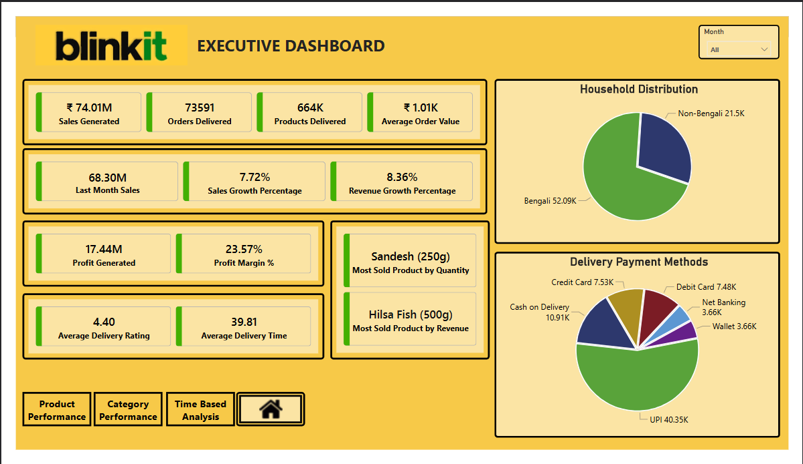
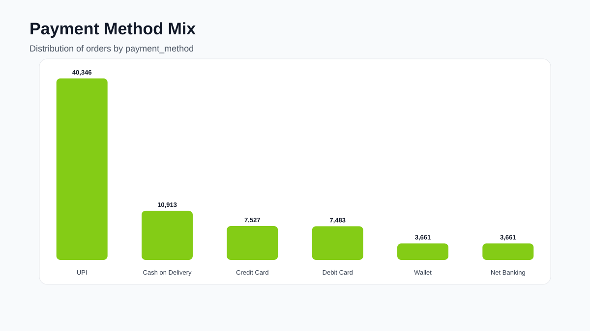

# Blinkit Kolkata Retail Analytics


A practical analytics project for exploring Blinkit grocery-order operations in Kolkata, cleaning core transactional datasets, and preparing analysis-ready outputs for dashboards and business insight generation.

## Dashboard Preview

> Snapshots generated from project data to provide quick visual context.




## Project Goals

- Standardize and validate raw order, order-item, and product data.
- Generate cleaned CSV/XLSX datasets for downstream analysis.
- Perform exploratory data analysis (EDA) to understand product mix, payment behavior, and operational trends.
- Produce dashboard-ready outputs (see `blinkit_dashboard.pdf`).

## Repository Structure

```text
.
├── README.md
├── LICENSE
├── EDA.ipynb
├── correcting_orders.ipynb
├── blinkit_dashboard.pdf
├── assets/
│   └── dashboard/
│       ├── dashboard_kpi_overview.svg
│       └── dashboard_payment_mix.svg
└── dataset/
    ├── orders.csv
    ├── orders.xlsx
    ├── orders_items.csv
    ├── orders_items.xlsx
    ├── products.csv
    ├── products.xlsx
    └── original_data_source/
        ├── kolkata_blinkit_orders.csv
        ├── kolkata_blinkit_order_items.csv
        └── kolkata_blinkit_products.csv
```

## Data Assets

| File | Rows | Description |
|---|---:|---|
| `dataset/orders.csv` | 73,591 | Order-level facts (date/time, channel, delivery, discount, net revenue, status). |
| `dataset/orders_items.csv` | 331,780 | Line-item facts per order (product, category, quantity, pricing, supplier). |
| `dataset/products.csv` | 166 | Product master with category hierarchy, supplier, pricing, and active flag. |

Raw source snapshots are preserved in `dataset/original_data_source/`, and spreadsheet exports are available as `*.xlsx` files.

## Schema Reference

### `orders.csv`
`order_id`, `order_date`, `order_time`, `customer_id`, `store_id`, `campaign_id`, `total_amount`, `delivery_fee`, `discount_amount`, `net_revenue`, `payment_method`, `delivery_duration_minutes`, `delivery_rating`, `order_status`, `is_festival_day`, `bengali_household`

### `orders_items.csv`
`order_id`, `product_id`, `product_name`, `category`, `quantity`, `unit_price`, `item_total`, `discount_per_item`, `supplier_id`

### `products.csv`
`product_id`, `product_name`, `category`, `subcategory`, `unit_price`, `cost_price`, `supplier_id`, `is_active`

## Notebook Workflow

### 1) `EDA.ipynb`
- Loads source datasets.
- Performs data quality checks (nulls, dtypes, structural review).
- Builds grouped summaries (supplier/product, payment patterns, category spread).
- Exports cleaned CSV outputs to `dataset/*.csv`.
- Creates baseline visualizations for reporting.

### 2) `correcting_orders.ipynb`
- Applies order-level corrections and field standardization.
- Re-maps campaign discount logic and recalculates `discount_amount` and `net_revenue`.
- Writes corrected results back to `dataset/orders.csv`.

## Quick Start

### Prerequisites

- Python 3.9+
- Jupyter Notebook or JupyterLab
- Libraries: `pandas`, `matplotlib`, `openpyxl`, `notebook`

### Setup

```bash
python -m venv .venv
source .venv/bin/activate
pip install pandas matplotlib notebook openpyxl
```

### Run

```bash
jupyter notebook
```

Recommended execution order:
1. `EDA.ipynb`
2. `correcting_orders.ipynb`

> Note: `correcting_orders.ipynb` expects `dataset/marketing.csv` to exist.

## Dashboard Output

- Final dashboard/presentation artifact: `blinkit_dashboard.pdf`
- Lightweight preview visuals for README: `assets/*.svg and *.png`

## License

This project is licensed under `LICENSE`.